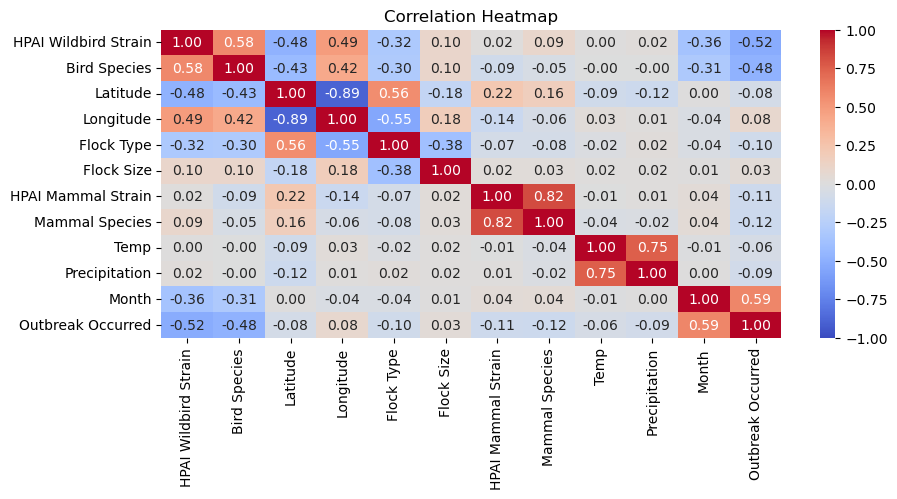
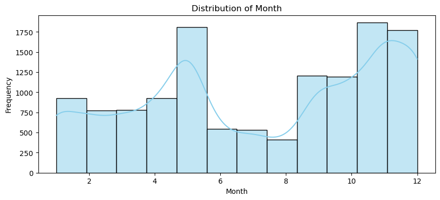
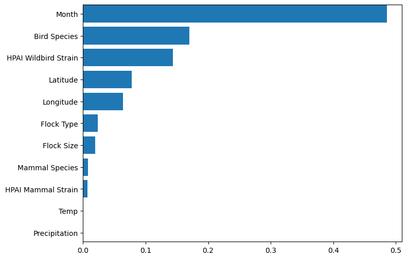

AI Bootcamp Project 2

## 📌 Project Overview
Bird flu is currently spreading in the US, posing a significant **public health risk** due to its **zoonotic potential** and causing economic damage to the poultry industry. This project aims to **analyze the severity of different bird flu strains using genomic data**.

### **Key Research Questions:**
1. **Based on the strain of avian flu, can we predict how long an outbreak will last?**
2. **How does bird flu compare to other flu outbreaks in the United States?**

### Why Machine Learning?
Machine learning helps us process large datasets efficiently while improving accuracy. We will apply:
- **K-Means Clustering** & **PCA (Principal Component Analysis)** for data exploration.
- **Classification models** (Random Forest, CNNs) for sequence classification.

## 📌 Data Collection & Sources
We have gathered data from multiple reputable sources, ensuring that our analysis is based on **official and scientifically validated data**. The process of data collection involved **extracting structured datasets from government and health organization portals, preprocessing them for inconsistencies, and integrating them into our analysis pipeline.**

### Primary Data Source:**
- Centers for Disease Control and Prevention (CDC)** - [Bird Flu Situation Summary](https://www.cdc.gov/bird-flu/situation-summary/index.html)
  - Data includes **geographical spread**, **infection rates**, and **clinical outcomes** of bird flu strains across different states.
  - We extracted reported cases of **H5N1 and other avian influenza strains** from CDC's public datasets.

### Secondary Data Sources:**
- Global Initiative on Sharing All Influenza Data (GISAID)** - [https://gisaid.org/](https://gisaid.org/)
  - Provides genomic sequencing data** of flu strains, essential for understanding viral mutations.
  - Data was retrieved through API requests and structured CSV formats.

- World Health Organization (WHO)** - [https://www.who.int/](https://www.who.int/)
  - Used for global perspective on bird flu trends** and **cross-country comparisons**.
  - WHO publications were parsed for trend reports and structured into time-series datasets.

- Data.gov (US Government Open Data Portal)** - [H5N1 Dataset Collection](https://catalog.data.gov/dataset/?q=H5N1+&sort=views_recent+desc&tags=avian-influenza&ext_location=&ext_bbox=&ext_prev_extent=)
  - Provided historical records of avian flu outbreaks, economic impacts on the poultry industry, and state-wise prevalence.
  - Data was cleaned using Python’s **Pandas library** to remove inconsistencies and missing values.

## 📌 Data Files in This Repository
We have uploaded several datasets and processing notebooks that document each step of our analysis:

| File Name | Description |
|-----------|-------------|
| **co-est2023-pop-updated.csv** | Population estimates used for regional flu prevalence analysis. Sourced from **Data.gov**. |
| **commercial-backyard-flocks.csv** | Data on flu outbreaks in **commercial vs backyard poultry flocks**, extracted from **CDC reports**. |
| **hpai-wild-birds.csv** | High Pathogenic Avian Influenza (HPAI) cases in **wild birds**, sourced from WHO's open-access dataset. |
| **mn_analysis_prj2.ipynb** | **Machine learning analysis & feature engineering**, processing structured influenza datasets. |
| **Data_Investigation.ipynb** | **Initial data exploration and cleaning** with visualization of infection trends. |
| **Data_Preprocessing_Round_2.ipynb** | **Advanced data preprocessing & transformation** including missing value imputation and normalization. |

## 📌 H5N1 Outbreak Prediction (Binary classification model)
### Did an H5N1 outbreak occur at a specific location and time?

**Objective:**
Our objective was to develop a machine learning model to predict whether an H5N1 outbreak will occur based on spatial, temporal, and environmental factors.

**Target Variable:**
Outbreak Occurred (Binary: 1 = Outbreak, 0 = No Outbreak)

**Features:**
1.	***Spatial Features:***
*Latitude* (Geographic coordinate)
*Longitude* (Geographic coordinate)
2.	***Temporal Features:***
*Month* (Seasonal trends affecting virus spread)
*Year* (Long-term epidemiological patterns)
3.	***Environmental Factors:***
*Temperature* (Influences virus survival and transmission)
*Precipitation* (Potential impact on virus persistence in the environment)
4.	***Host-Related Features:***
*Bird Species* (Certain species are more susceptible)
*Mammal Species* (Tracking potential spillover events)
*Flock Type* (Backyard, commercial, wild populations)
*Flock Size* (Higher density may increase transmission risk)

### Features Correlation Heat map

### Key Observations from the Correlation Matrix:

#### Month and Outbreak Occurred (0.55 correlation):
A moderate positive correlation suggests that outbreaks may occur more frequently during specific months, potentially correlating with seasonal patterns (e.g., migratory periods).

#### HPAI Mammal Strain and Mammal Species (0.83 correlation):
HPAI Mammal Strain and Mammal Species have a high positive correlation (0.83), which suggests that that specific mammal species are more prone to certain HPAI strains.

#### Flock Type and Latitude (0.55 correlation):
Flock Type and Latitude have a moderate positive correlation, indicating that certain types of flocks might be located at specific latitudes.

#### HPAI Wildbird Strain and Latitude (0.43 correlation):
The HPAI Strain_x (Wild bird strain) has a moderate positive correlation with the Longitude which means certain bird species are specific to that longitudinal locations. 

### Month distribution of the Outbreak

This data coincides with the 3 seasons in a sampling year

1. We see a pike in May, which is the breeding month.
2. Pike in November which coincides with fall migration.
3. December and January Months which are the wintering months

### Feature importance:

**Month** is a major predictor of the outbreak data.

### Model Selection [Classification Model : Outbreak prediction]

1. Logistic Regression
2. Random Forest Classifier

### Expected Outcomes:
1. A predictive model capable of estimating H5N1 outbreak risk in specific regions.
2. Insights into how environmental and host factors contribute to H5N1 outbreaks.
3. Potential applications in surveillance and early warning systems

## 📌 Project Team
**Team Name:** The Flockbusters 🦠🐦
- **Christopher Davis**
- **Matthew Ward**
- **Caleb Kelson**
- **Mary Pulley**
- **Madhavi Nithianandam**
- **Katie Craig**

**TA:** Revati
